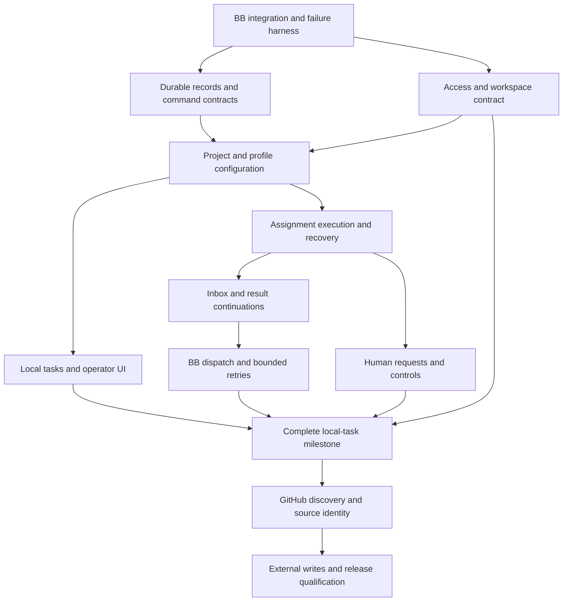

# Delivery tickets

Published as [epic #649](https://github.com/chrisbanes/ensemble/issues/649) and
native sub-issues, with blocking dependencies. GitHub issues track execution;
these briefs retain the reviewed scope and decision history. Publication does not
resolve capability gates or mark dependent features ready-for-agent. The legacy
backlog is retired as superseded by the TypeScript BB plugin direction.
This delivery-ticket dependency map is distinct from the product's task
dependency gate.

Parent epic: **Deliver Ensemble's BB-based autonomous project coordination MVP**.
Outcome: an operator configures projects, adds local or selected GitHub tasks, and
supervises concurrent agent-led delivery with durable handoffs and recovery.
Acceptance: [release gates](acceptance.md#gates), not a collection of merged PRs.

## Published issues

| Ticket | GitHub issue |
| --- | --- |
| T01 | [#650 — Establish BB compatibility and automated integration harness](https://github.com/chrisbanes/ensemble/issues/650) |
| T02 | [#651 — Prove execution access and workspace retention boundaries](https://github.com/chrisbanes/ensemble/issues/651) |
| T03 | [#652 — Implement durable domain records and idempotent commands](https://github.com/chrisbanes/ensemble/issues/652) |
| T04 | [#653 — Add project and profile configuration in BB](https://github.com/chrisbanes/ensemble/issues/653) |
| T05 | [#654 — Deliver local task list, detail, and creation UI](https://github.com/chrisbanes/ensemble/issues/654) |
| T06 | [#655 — Launch assignment threads and reconcile execution](https://github.com/chrisbanes/ensemble/issues/655) |
| T07 | [#656 — Deliver results and resume waiting owners](https://github.com/chrisbanes/ensemble/issues/656) |
| T08 | [#657 — Coordinate dispatch with BB concurrency and bounded retries](https://github.com/chrisbanes/ensemble/issues/657) |
| T09 | [#658 — Add durable human questions and execution controls](https://github.com/chrisbanes/ensemble/issues/658) |
| T10 | [#659 — Qualify the complete local-task milestone](https://github.com/chrisbanes/ensemble/issues/659) |
| T11 | [#660 — Discover GitHub tasks with source memberships](https://github.com/chrisbanes/ensemble/issues/660) |
| T12 | [#661 — Reconcile external writes and qualify the operational release](https://github.com/chrisbanes/ensemble/issues/661) |

## Delivery focus

### Host-independent foundation

[ADR-1003](adr/1003-host-independent-core.md) changes the implementation boundary,
not the product's coordination behavior. The bounded prototype is now split
into core and BB adapter modules, with [P01–P05](acceptance.md#portability-extraction-gate)
proved by standalone and isolated real-BB tests on 25 September 2026. It retains
one assignment per task and the existing tool flow; it does not implement the
remaining MVP. The installed Haze prototype is unchanged. The schema transition
is transactional and tested against legacy records.

Apply the following ownership to the existing briefs when implementation resumes:

| Tickets | Core responsibility | BB integration responsibility |
| --- | --- | --- |
| T01/T02 | Standalone host-contract fixtures and policy invariants | Real BB compatibility, execution access, capacity and workspace lifecycle evidence |
| T03 | Ensemble identities, SQLite schema/migrations, durable commands and bindings | Supply the database connection and authenticated host context |
| T04/T05 | Portable profile identity/instructions, project policy, task commands | Versioned execution settings, catalog validation, BB configuration and UI |
| T06–T09 | Launch/delivery intent, eligibility, authorization, recovery and human-request state | Host execution, observation, stop, wakeups, and interface delivery |
| T11/T12 | External identity, source membership, admission and write policy | GitHub transport/authentication; BB credential and repository lookup behind the integration |

Core development and standalone checks need no running BB. Dependent execution
features still require their BB capability proofs, and T10 still requires the
complete real-host journey. The existing dependency map below governs those
product tickets; it does not force pure extraction tests to wait for unrelated
execution capabilities. No new feature passes a gate merely by being portable.

The current manifest, CI and integration harness pin SDK package 0.5.29 and npm
12.1.0. The [25 September qualification](bb-capabilities.md#current-toolchain-qualification--25-september-2026)
used SDK package 0.5.27. Its aggregate passed with the exact expected diagnostic
envelope, but that result does not qualify SDK 0.5.29. Startup and
writer-termination failures remain explicit. The extraction is
complete, while their dependent product features remain gated.

These local briefs have been revised; linked GitHub issues have not been updated
by this design session. Reconcile their scope before using them as implementation
authority. A second host, service deployment, multi-host operation and active-work
migration are outside this foundation.

### Operational product

Build the [first local-task journey](SPEC.md#first-local-task-journey) across
T04–T10, supported by T01–T03. Profiles are reusable configuration; do not add bot
identities, personal bot state or a bot management ticket. T11–T12 add GitHub sync
to the same task model after the local journey passes.

Remaining technical work is tied to observable points in that journey:

| Journey boundary | Unresolved proof | Existing tickets |
| --- | --- | --- |
| Owner/worker starts | Reconcile uncertain spawn and workspace provisioning; acquire a writer only at effective admission | T01/T02/T06 |
| Eligible work waits or resumes | Resolve Ensemble-to-BB dispatch handoff, including pause/stop during queueing and plugin startup failure; compose with BB concurrency | T01/T06/T08 |
| Result or answer resumes work | Reconcile accepted sends after lost responses, retain event acknowledgements and reject stale destinations | T01/T07/T09 |
| Stop, retry or apply settings | Confirm writer termination, shared retry allowance and revised settings on the intended next turn | T01/T02/T04/T06/T08 |

These are implementation investigations against accepted behaviour, not a new
product questionnaire. The [capability evidence](bb-capabilities.md) records the
partial results and open gates. Resolve each gate before its dependent feature;
do not treat the failed hook-only approach as proof that all development needs an
upstream BB change. Keep the existing dependency map until the relevant gate is
resolved rather than silently marking dependent tickets ready.

## Dependency map

UI delivery is integrated with its feature tickets. T10 assembles and validates
the full journey; it does not defer all integration until the end. Each feature
runs in the isolated BB harness from T01 and adds its scenarios as it lands.

## T01 — Establish BB compatibility and automated integration harness

**Capability result:** the [full isolated T01 harness](bb-capabilities.md) now
proves that a later public `message.dispatch` reject composes with another
plugin's wait and BB core busy-queueing while Ensemble is loaded. It still fails
the mandatory startup boundary: if Ensemble and the external wait owner both fail
to initialize, BB releases the accepted queue row and sends it to the separately
loaded provider. A separate public-queue probe confirms that `threads.queuedMessages.create`
on an idle thread is automatically dispatched, not held. T01 also recovers a
lost response for both sent and queued messages by unique public markers after
restart; ambiguous matches remain `uncertain`, with no blind resend.

Issue [#650's acceptance](https://github.com/chrisbanes/ensemble/issues/650)
defines this as a capability/harness ticket: unsupported mandatory behaviour is
recorded in the matrix and tracked by a concrete dependency. The harness command,
result matrix and bounded failed capability can therefore satisfy T01 after
review, without treating startup as passed. Issue
[#665](https://github.com/chrisbanes/ensemble/issues/665) tracks the unresolved
accepted-queue/startup contract and blocks T06/T08 execution work until a public
API design or tested BB capability proves protected work remains held while
Ensemble is unavailable. Two earlier no-start measurements are historical:
the focused pre-correction T5 run recorded 2,442 ms after recheck with 2,150 ms
stable no-start; the distinct pre-correction integrated run recorded 2,361 ms
with 2,066 ms stable no-start. The trace-timing race found afterward means
neither measurement is current no-start acceptance evidence.

The final corrected integrated report at
`33bd3062531bd2ab717d4ea8d4a29752c6388058` is the current acceptance evidence.
On Node 24.21.0/npm 12.1.0, BB 0.44.0 and host/plugin SDK 0.5.29, all three
checks passed: `npm run check`, `npm run test:bb-integration`, and
`npm run test:bb-prototype`.
The report contains six T5 gate rows. Its corrected stop observation records
stop acknowledgement while pending, exact-ID cancellation with the matching
`message.cancelled` event and queue absence before and after recheck. The
post-recheck window was 2,378 ms, including 2,087 ms of stable no-start, with
zero provider starts and tool effects. T4 produced its expected diagnostic, and
every T1–T5 manifest confirms clean isolation cleanup.

This supports removing only the T02 block specific to
[#676](https://github.com/chrisbanes/ensemble/issues/676), pending the focused
repair review; T06/T08 remain blocked by #665 and other gates.
`stop-writer-release` remains open. This evidence covers one scripted held first
message, not termination of arbitrary workspace processes or complete Ensemble
writer exclusion. These findings do not yet establish that BB must change.
Other harness and design work can continue.

**Depends on:** reviewed product scope. **Acceptance:** A01, foundations for A08/A09/A17.

Build an isolated, version-checked BB installation with actual plugin loading,
SQLite, temporary repositories, and a scripted provider. Prove public API support
for spawn, rich execution configuration, lifecycle events, restart, message
identity, plugin tools, human interactions, and environment retention. Record
supported behaviour for the tested plugin SDK 0.5.24 package on BB 0.43.4's
declared SDK 0.5.9 host compatibility, or select a tested replacement together.

Done when one command starts the instance, loads a fixture plugin, exercises a
scripted tool/result round trip, restarts BB, asserts persisted state, and cleans
up only its own resources. Include a lost-response injection. Produce a capability
matrix; unsupported mandatory behaviour gets a concrete BB dependency ticket.
Cover the [state/recovery proof gates](design/bb-plugin.md#remaining-proof-gates-for-state-and-recovery),
including queued dispatch during startup and lost-message acceptance.
No internal BB imports, production data paths, authenticated model, or shared Haze
checkout in this test. A type-check-only harness does not satisfy the ticket.

## T02 — Prove execution access and workspace retention boundaries

**Depends on:** T01. **Acceptance:** A13, A15–A17, A25; security decision D3.

Document the actual BB/provider permission modes and environment behaviour.
Prove shared task worktrees, writer reservations and BB cleanup behaviour when
threads stop, archive, or delete. Cover both configured archival modes and the
retain-until-archive default, including direct BB archival of dirty workspaces.
Show the limits of shell, ambient credentials and direct BB API access. Enforce
Ensemble's own commands without claiming independent agent isolation.

Done when integration tests reject forbidden Ensemble actions, faithfully pass
supported BB permissions, and confirm workspace retention under the supported
lifecycle. UI must distinguish Ensemble policy from execution controls. Missing
workspace/stop capabilities require a concrete BB dependency or reviewed limitation;
custom host sandboxing is outside this release.

## T03 — Implement durable domain records and idempotent commands

**Depends on:** T01 and reviewed state/command contracts. **Acceptance:** A03, A07, A18, A22, A28 foundations.

Implement migrations, task/assignment identity, profile revisions, conversation
generations, owner uniqueness, launch intent, inbox/outbox records, results and
human requests from the design. Expose one validated command service to tools/RPC.
Use expected versions for competing edits and durable command receipts for
operation retries, including payload conflicts and pending-response replay. Keep
provider statuses separate from task and execution state. Persist local task
dependency edges separately from readiness and assignment waits. Use
operator-only, versioned commands with idempotent receipts, control revisions
and cycle rejection.

Done when transaction rollback, file reopen, conflicting retry, concurrent owner
claims, stale generation results and migration replay are tested using real
SQLite. Prototype data is exported or explicitly retired before any replacement;
no live reset occurs as part of development.

## T04 — Add project and profile configuration in BB

**Depends on:** T02, T03. **Acceptance:** A02, A13 configuration paths.

Provide operator UI for a BB project, instructions, shared revisioned profiles
and project profile selection,
provider/model/reasoning/tier, environment choice, cleanup mode, and effective BB
execution controls. Do not add Ensemble concurrency caps.
Use BB catalogs and reject unavailable combinations. Projects begin paused.
Keep settings project-scoped, replacing the prototype's singleton project and
worker fields. Create/manage the lead binding without asking users for thread IDs.

Done when browser tests configure two independent projects and profiles, restart,
read them back, reject invalid capability choices and show revisions used by
existing assignments. Existing assignments retain revisions until explicit apply
for their next turn; new assignments use the current revision. Agent commands
cannot alter configuration or broaden access.

## T05 — Deliver local task list, detail, and creation UI

**Depends on:** T04. **Acceptance:** A03, A28 UI and task-facing portions of A26.

Add Ensemble's navigation panel, task creation/editing, project task list and task
detail with assignments, results, source provenance and BB conversation links.
Start with a list view; Kanban is optional after acceptance, not a release blocker.
Display work status independently from execution and external state. Show
blockers and their provenance; let operators add or remove local task edges
within the project through distinct controls; scoped agent task edits cannot
change edges. Provide clear empty, loading, unavailable, conflict and
error states.

Done when browser tests create/edit/reopen a task and inspect persisted records
through real RPC. The operator never supplies UUIDs or runs a setup CLI. Local
creation works with no tracker configured and never creates a GitHub issue.

## T06 — Launch assignment threads and reconcile execution

**Depends on:** T04. **Acceptance:** A05, A07/A08, A15–A18.

Resolve a profile revision, construct contextual prompts, select an allowed
workspace, persist intent, and call the public BB spawn API. Record current
conversation generation and lifecycle observations; query after launch and
reconcile after restart. Support owner self-execution and bounded delegation;
remove the prototype's one-assignment-per-task restriction. Record readable titles
and task/parent references without unsafe lifecycle cascades.

Done when fault-injected real BB tests reconnect a created worker after a lost
response, hold ambiguous/multiple matches, reject conflicting ownership, and
prevent two writers using the same workspace. A stopped/failed/deleted thread
cannot be mistaken for a successful result. Do not add a fixed development DAG.

## T07 — Deliver results and resume waiting owners

**Depends on:** T06. **Acceptance:** A06/A07/A09/A10/A18.

Persist result plus recipient event atomically. Add inbox read/acknowledgement,
coalesced wakeups, continuation admission, and reconstruction from durable records.
Use the BB message retry/lookup contract proved in T01; represent uncertainty
explicitly if accepted delivery cannot be established. Bind results to generation
and artifacts; preserve superseded outcomes as history.

Done when automated real BB tests kill the plugin/server across every result and
delivery boundary, resume the intended parent, and prove one logical result and
one resulting operation. No operator follow-up prompt is needed to read a result.
A duplicate wakeup must not duplicate work or external effects.

## T08 — Coordinate dispatch with BB concurrency and bounded retries

**Depends on:** T07; dispatch decision D2. **Acceptance:** A04/A11/A14/A27/A28.

Wake project leads for eligible task changes and durable events. Leads choose
work using instructions; the runtime enforces ownership, dependency eligibility
and resource admission. Honor BB’s Concurrency limit plugin without separate Ensemble caps; owners and
leads yield while waiting for children or human input. Prove progress at capacity one. Persist pause intent and retry budgets. Surface BB manual
overrides honestly. Failed work does not retry indefinitely.

Done when two-project scripted tests show independent progress, bounded execution,
no competing owner, blocked Ready tasks held until confirmed clearance, and
retained wakeups across pause/restart. Exercise a local blocker added while work
is active or BB-queued. Changing reviewer count or order requires instructions
only. No hard-coded planning/review stages.

## T09 — Add durable human questions and execution controls

**Depends on:** T06, T03. **Acceptance:** A12–A15 and request recovery in A09.

Add task-visible questions, scoped approvals, responses, pause/resume and stop.
Persist reviewed action/material identity, distinguish question from permission,
and invalidate stale approval. Use BB provider interactions where their lifecycle
meets the proved contract; Ensemble owns task-level request state and delivery.

Done when browser/integration tests answer during restart, reject stale/denied
approval, pause one project while another progresses, and show stopping until BB
confirms actual termination. Include unavailable-machine and canceled-request UI.

## T10 — Qualify the complete local-task milestone

**Depends on:** T05, T07, T08, T09, T02. **Acceptance:** local gate in acceptance.md.

Automate the full UI-to-lead-to-owner-to-worker-to-result journey, including a
review/revision chosen by instructions, human question, restart and duplicate
command delivery. Exercise a local Ready task held by another local task until
confirmed completion, plus a local edge added during active or queued work.
Run one bounded real-provider smoke in a disposable repository;
the implementation agent executes and inspects it. Produce a reviewable demo and
scenario evidence report. Fix integration failures within this milestone.

Done when the local gate passes with no user-operated integration steps, no
unresolved mandatory BB capability, and no production Haze changes. A working
spawn button alone is insufficient. User review accepts the finished flow before
moving the shared installation beyond the prototype.

## T11 — Discover GitHub tasks with source memberships

**Depends on:** T10. **Acceptance:** A19–A23, A28 imported-blocker path, A29–A30.

Add project-scoped linked-repository issue and GitHub Project selections. Page
complete results, preserve provider field provenance and canonical identity, and
retain source memberships. Implement reviewed overlap and withdrawal policies.
Exclude PRs/drafts; discovery cannot add repository access. Local tasks remain
available alongside external ones. Reuse BB GitHub capabilities only where their
contracts meet full discovery requirements. Import complete native dependency
observations, including blockers outside the selection; unreadable or partial
blocker state holds dispatch. Do not create parallel Ensemble edges for imported
issues.

Done when deterministic provider fixtures prove pagination, partial errors,
missing/duplicate observations, overlap and withdrawals, and a designated test
repository/Project proves the same mapping live. UI shows synchronization state
and conflicts. Exercise a failed or partial first dependency read for a newly
discovered Ready issue, native blocker closure, removal, reopening and mid-work
addition, plus an unreadable imported blocker of a local task, in the scripted
adapter and designated live fixture. No live Haze queue is imported until
explicit rollout.

## T12 — Reconcile external writes and qualify the operational release

**Depends on:** T11; completion decision D1. **Acceptance:** A24/A26 and full release gate.

Implement authorized external updates and the selected delivery boundary with
persisted action intent and confirmed readback. Separate issue state, Project
fields, task completion, PR readiness and merge. Inject lost responses after
provider success; inspect before retry. Apply approvals and credential constraints
from T02. Finish the release report and operator setup/recovery documentation.

Done when all applicable scenarios pass, one bounded live GitHub/provider flow
meets D1, and a clean install/upgrade is demonstrated. Report any unavailable
integration evidence as an open gate. The user reviews the finished result;
implementation is not handed back as a sequence of manual smoke-test requests.

## Decisions before publication

**Product framing — accepted:** projects and tasks, reusable agent profiles and
optional GitHub sync. Conversations serve project leads and task assignments.
Persistent bot identities, personal bot state and a bot management UI are outside
scope. Bots Sidebar is a reference for conversation binding/navigation only.

- **D1 — accepted:** completion is configured per project from the first release:
  reviewable PR or through merge, subject to granted permissions and completion
  conditions. Non-code tasks finish with their agreed artifact.
- **D2 — accepted:** enabled projects automatically select from an explicitly Ready
  queue, using an explicit Ready state or authoritative source readiness rule. Other tasks can be
  triaged but are not implicitly admitted. Only the operator or an explicitly configured source rule may admit work.
  Newly configured projects start paused and require explicit enablement.
- **D3 — accepted:** use BB/provider execution controls on a trusted single-operator
  installation. Ensemble enforces its own actions and discloses the execution
  boundary; it does not build an independent security sandbox.
- **D5 — accepted:** Ready authorizes in-scope work without universal plan approval;
  ambiguity, scope expansion and ungranted actions require input.
- **D6 — accepted:** reviewable-PR tasks retain ownership and handle CI/review
  feedback after handback; merge is manual and merge/explicit acceptance/closure
  settles delivery.
- **D7 — accepted:** merge readiness follows project instructions and actual
  GitHub requirements. Ensemble checks authority and records evidence; no universal
  structured review policy is introduced.
- **D8 — accepted:** task dependencies are a separate execution gate for Ready
  work. Local dependent tasks use Ensemble-owned edges within a project; imported
  GitHub issues follow native edges, even when the blocker is outside the selected
  source or Ensemble project. Hold unknown blocker state and later turns when a
  blocker appears; provide no Ensemble bypass for an extant edge. Re-evaluate
  automatically after confirmed clearance, without clearing unrelated holds.
  Disclose BB's direct Send-now override as outside this enforcement boundary.
- **D4:** operational choices are recorded as O1–O11 below; review their technical
  contracts and prove BB integration capabilities before implementation.

T01/T02 are bounded evidence/design tickets, not permission to resume incremental
product implementation. High-level choices D1/D2/D3/D5/D6/D7/D8 are confirmed. Review D4 technical contracts and prove BB capability gaps
before marking dependent feature tickets ready.

## GitHub interview decisions

- **G1 — accepted:** import the selected backlog; readiness is a separate admission rule.
- **G2 — accepted:** authorized agents may post progress/results and update configured
  labels/Project fields. Title/body changes require separate operator approval.
- **G3 — accepted:** one authoritative readiness rule per Ensemble project; agent
  workflow writes cannot grant admission.
- **G4 — accepted:** issue closure is a separate project permission, conditional
  on actual completion; observe GitHub automatic closure without duplicate writes.
- **G5 — accepted:** withdrawal, lost readiness or external closure holds new
  delegation and asks the owner to stop safely. Operator resolution precedes
  resumption except closure confirmed as this task's own delivery.
- **G6 — accepted:** incorporate harmless clarification; hold affected work and
  ask before changing the admitted outcome or materially expanding scope.
- **G7 — accepted:** operator chooses placement for overlapping projects; retain
  existing ownership and block newly conflicted unowned issues from dispatch.

GitHub high-level decisions G1–G7 are confirmed. Detailed T11/T12 design and
the remaining technical defaults still require review before implementation.

## Operational interview decisions

- **O1 — accepted:** new projects start paused; the operator explicitly enables dispatch.
- **O2 — accepted:** project pause lets active turns finish, holds new turns and
  queued continuations, and retains incoming results and observations.
- **O3 — accepted:** task stop requests termination of its owner and all active
  workers, holds queued work until explicit resume, and preserves files/history.
  Stop does not cancel the task; termination must be confirmed before claiming it.

- **O4 — accepted:** one task worktree shared by its assignments, with one writer
  at a time; parallel reviews reference a fixed revision. Multi-repository work
  needs a worktree per participating repository, not per agent.
- **O5 — accepted:** use BB workspace cleanup, configurable between retaining
  conversations until operator archival and archival after confirmed delivery
  with preservation checks. Default to retain-until-archive.
- **O6 — accepted:** existing assignments retain recorded instructions; updates
  require explicit application for their next turn. New assignments use current
  configuration; permission revocations still apply to subsequent actions.

- **O7 — accepted:** honor BB's Concurrency limit plugin; no additional Ensemble
  global default or per-project cap in the first release.
- **O8 — accepted:** at most two retries with backoff for confirmed transient
  execution failures, then hold for attention; reconcile uncertainty first.
- **O9 — accepted:** default to retain-until-archive.
- **O10 — accepted:** defer transfers of already-owned tasks between projects;
  initial placement conflict resolution remains in scope.
- **O11 — accepted:** flag prolonged inactivity for operator attention; silence
  alone does not trigger automatic termination or restart.

Operational choices O1–O11 are accepted. Technical contracts and acceptance
coverage still require review before implementation.

## Operator experience interview decisions

- **U1 — accepted:** profiles are shared across projects; projects select allowed
  profiles and provide their own instructions.
- **U2 — accepted:** task discussion uses the owner's linked BB conversation;
  structured questions and approvals also appear in Ensemble.
- **U3 — accepted:** local tasks are unready by default; an explicit Create and
  start action marks them Ready while respecting project pause and BB controls.

- **U4 — accepted:** query-first source selection, with validation and matching
  issue preview. Exact source-specific query contracts still need design.
- **U5 — accepted:** a simple readiness builder with all/any label and Project
  field-value conditions; no nested expressions initially.
- **U6 — accepted:** a shared attention inbox across projects, with task links
  and resolution actions, alongside attention items in task detail.

- **U7 — accepted:** use existing BB notification facilities where supported,
  linking to attention items without repeated alerts for unchanged items.
- **U8 — accepted:** non-code tasks finish when the owner records the requested
  outcome and evidence; approval is required only by instructions or permissions.

Operator experience decisions U1–U8 are confirmed.
Source query and BB notification capabilities remain technical verification work.

## Integration scope interview decisions

- **I1 — accepted:** GitHub.com first; native issue-search and Project-filter
  syntax for the respective sources. Enterprise Server compatibility is deferred.
- **I2 — accepted:** polling first, with manual refresh and visible last-success
  time; recheck relevant remote state before consequential actions.

- **I3 — accepted:** reuse BB's GitHub integration and server-side `gh` login;
  show identity and missing access without another credential store.

Integration scope I1–I3 and the notification limitation are confirmed. BB supports in-app plugin
alerts and built-in thread notifications; arbitrary Ensemble OS/push alerts are
not established. API contracts and live compatibility still require verification.

## State and recovery design review

The technical design now separates durable assignment lifecycle from BB execution
observations and defines command receipts, independent hold reasons, writer
handoff, inbox acknowledgement, and ordered restart reconciliation. The acceptance
plan adds race and crash cases under existing A07–A27 IDs. These are proposed
technical contracts implementing the accepted policy; BB proof gates remain open.
No feature implementation or shared BB changes are authorized by this review.

Independent review identified two contract gaps: writer reservation before BB
admission and missing links between inbox events and resulting operations. Both
were corrected in the draft and added to A09/A16 boundary checks. This review is
of documentation only; none of the BB proof gates is marked passed.

## Technical walkthrough decisions

- **R1 — accepted:** reopen the same assignment for follow-up on the same work,
  recording a new request/work revision and retaining earlier immutable results.
  Reuse the conversation when available; replacement conversation identity remains
  separate from work revision.
- **R2 — accepted:** after a confirmed turn ends without result or explicit wait,
  send one persisted reporting prompt. If that repair turn also omits a report,
  hold for attention. Respect pause/stop and preserve the allowance across restart.

- **R3 — accepted:** results arriving during an owner's active turn remain queued
  for its next turn; voluntary inbox reads are allowed, automatic steering is not.
- **R4 — accepted:** coalesce pending results into one continuation while retaining
  each event and its processing acknowledgement separately.

- **R5 — accepted:** previously enabled work resumes automatically after successful
  reconciliation; existing pause/stop controls remain in force.
- **R6 — accepted:** uncertainty holds affected operations and dependent work;
  reconciliation and established independent work may continue. Unknown writer
  status blocks further workspace writes; unclear independence remains held.

- **R7 — accepted:** exhausted delegated-worker retries hold that assignment and
  notify the owner first. The owner may diagnose, take over or choose another
  approach within scope; blind relaunches cannot reset the retry allowance.

Technical walkthrough choices R1–R7 are confirmed.
Detailed BB proof gates remain open.
